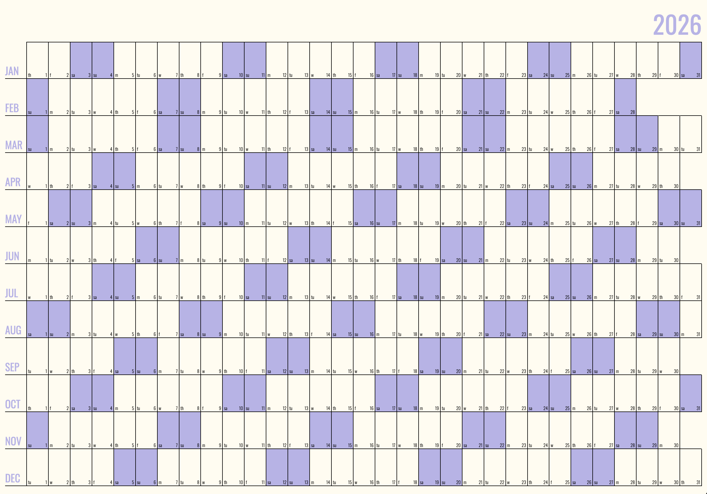

# gridcal

this is an alternative to [neatocal](https://github.com/abetusk/neatocal) that displays the months row-wise instead of column-wise.



example `gridcal_data` value in localstorage
```json
{
  "2026-01-01": "New Year's Day",
  "2026-02-16": "Family Day",
  "2026-04-03": "Good Friday",
  "2026-05-18": "Victoria Day",
  "2026-07-01": "Canada Day",
  "2026-08-03": "British Columbia Day",
  "2026-09-07": "Labour Day",
  "2026-09-30": "Truth and Reconciliation Day",
  "2026-10-12": "Thanksgiving Day",
  "2026-11-11": "Remembrance Day",
  "2026-12-25": "Christmas Day"
}
```
